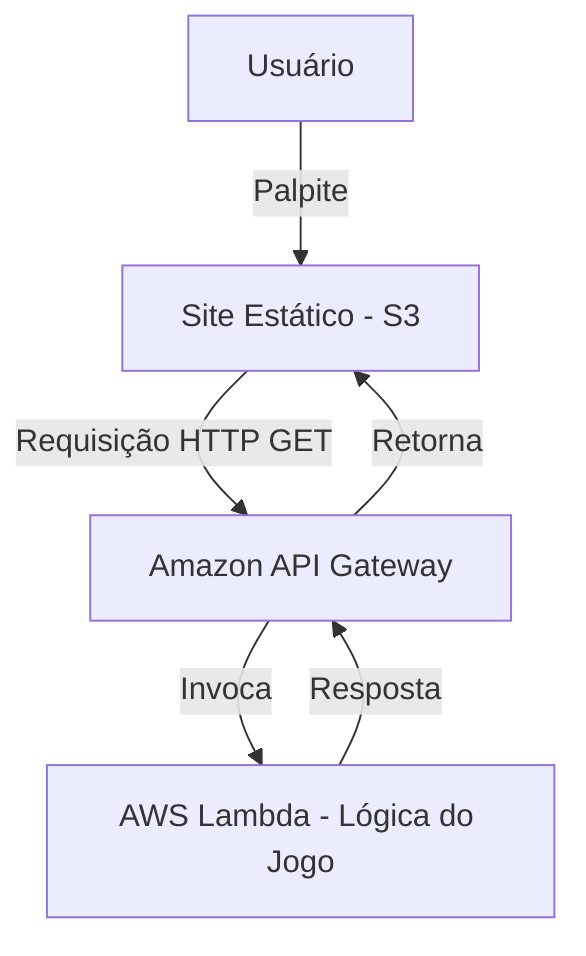

# 🎯 Jogo de Adivinhação com AWS Lambda, API Gateway e S3

)
https://github.com/Danniel30/Jogo-de-Adivinhacao/issues/1#issue-3111708806
Este projeto é resultado da realização do **Laboratório** da **Escola da Nuvem**, onde desenvolvi uma aplicação completa utilizando serviços serverless da AWS.

## ✅ Descrição do Projeto

Um jogo de adivinhação no qual o usuário tenta acertar um número entre 1 e 10. A lógica do jogo é processada por uma **função Lambda**, exposta via **API Gateway** e consumida por um frontend estático hospedado no **Amazon S3**.

---

## 🚀 Tecnologias e Serviços Utilizados

* **AWS Lambda** — Função serverless que processa a lógica do jogo.
* **Amazon API Gateway** — Exposição da função Lambda via API RESTful.
* **Amazon S3** — Hospedagem do frontend como site estático.
* **Python 3.9** — Linguagem utilizada na função Lambda.
* **HTML, CSS e JavaScript** — Desenvolvimento da interface web do jogo.

---

## 🛠️ Passos Realizados

### 1️⃣ Criação da Função Lambda

* Desenvolvi a função Lambda em Python com a lógica do jogo.
* Realizei o upload do código via arquivo `.zip`.
* Realizei o deploy da função.

### 2️⃣ Configuração do API Gateway

* Criei uma **API HTTP** para expor a função Lambda.
* Configurei a integração entre API e Lambda.
* Defini o método `GET` e o recurso `/jogo`.
* Configurei **CORS** para permitir chamadas do frontend.

### 3️⃣ Desenvolvimento e Personalização do Frontend

* Editei o arquivo `index.html`:

  * Adicionei meu nome ao lado de “Escola da Nuvem💙”.
  * Configurei a URL gerada pelo API Gateway.

### 4️⃣ Publicação no Amazon S3

* Criei o bucket com nome exclusivo.
* Fiz upload do arquivo `index.html`.
* Ativei a **hospedagem de site estático**.
* Configurei permissões públicas para permitir o acesso.

---

## 🌐 Como Executar

1. Acesse o site hospedado via o **endpoint do S3**.
2. Digite um número de 1 a 10.
3. Clique em **Enviar**.
4. O site envia a requisição via API Gateway → Lambda → Responde ao frontend informando se o palpite está correto.

---

## ⚙️ Arquitetura da Solução

---

## 📝 Como Personalizar

* Substitua o texto “Escola da Nuvem💙 - Danniel de Albuquerque” pelo seu nome.
* Configure a **URL de invocação** da sua API no arquivo `index.html`.
* Pode adicionar melhorias no estilo com CSS e ajustar a interface conforme desejado.

---

## 🛡️ Observações Importantes

* Lembre-se de **deletar os recursos** após o uso para evitar custos:

  * Esvaziar e excluir o bucket S3.
  * Excluir a API no API Gateway.
  * Remover a função Lambda.

---

## 🙌 Agradecimentos

Projeto realizado com apoio e orientação da **[Escola da Nuvem](https://escoladanuvem.org/)**.

---

## 📣 Contribuição

Este laboratório foi essencial para aprimorar minhas habilidades em **desenvolvimento serverless** e integração de múltiplos serviços na AWS.
Sinta-se à vontade para enviar sugestões, abrir issues ou contribuir!

---

## 🚀 Autor

**Danniel de Albuquerque**
[🔗 LinkedIn](https://www.linkedin.com/in/danniel-de-albuquerque/)
[🔗 GitHub](https://github.com/Danniel30)
